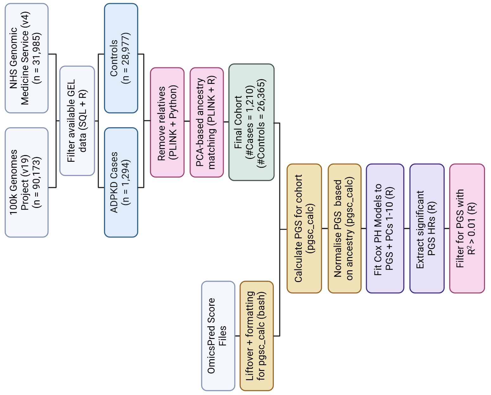

# cykd-pgs-nextflow
A Nextflow pipeline that extracts cystic kidney disease (CyKD) cohort data from the Genomics England Research Environment (GEL RE) and calculates OmicsPred Polygenic Scores (PGSs) that are significantly associated with the disease. The OmicsPred PGSs are publicly available [here](https://www.omicspred.org/downloads).
